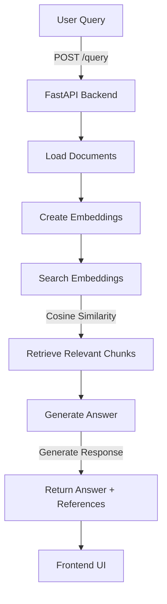

# How Fiona Chatbot Works

## Backend

The backend, built with **FastAPI**, processes user queries, retrieves relevant information, and generates responses. Here's an overview:

### 1. Startup Process

- On startup, the `startup_event` function in `app.py` loads documents (`features_of_steve.txt` and `plan_your_research_project.txt`) from `backend/documents`.
- These documents are passed to `create_embeddings` in `embedding_manager.py`, which generates vector embeddings using the `SentenceTransformer` model. The embeddings are stored in memory.

### 2. Query Handling

- The `/query` endpoint in `app.py` receives user queries via POST requests.
- Queries are processed by `search_embeddings` in `retrieval.py`, which uses cosine similarity to find the most relevant document chunks.
- The chunks are passed to `generate_answer` in `llm_generator.py`, which uses the `flan-t5-large` language model to generate a response, including references to source documents.

### 3. Logging

- Logging in `app.py` tracks key events like document loading, embedding creation, query handling, and response generation.

### 4. Dependencies

- Key libraries include `sentence-transformers` for embeddings, `transformers` for language model inference, and `scikit-learn` for similarity calculations.

---

## Frontend

The frontend, built with **React**, provides a user-friendly interface for interacting with the chatbot.

### 1. User Interface

- The main component, `Chat.js`, includes a text area for input, a "Send" button, and a section to display responses and references.
- Styling is handled by `Chat.css` and `styles.css`.

### 2. Query Submission

- The `handleQuery` function in `Chat.js` sends user queries to the backend's `/query` endpoint via POST requests.

### 3. Response Handling

- Responses, including answers and references, are received as JSON and displayed in the UI.

### 4. Logging

- Console logs in `Chat.js` track queries and responses for debugging frontend-backend communication.

---

## Backend-Frontend Integration

### 1. API Communication

- The frontend communicates with the backend via HTTP requests to the `/query` endpoint. The backend runs on `http://localhost:8000`, and the frontend on `http://localhost:3000`, php integration `http://localhost:8080/index.php`

### 2. CORS Configuration

- FastAPI's `CORSMiddleware` enables cross-origin requests from the frontend.

---

## Deployment

### 1. Dockerized Setup

- Both backend and frontend have `Dockerfile` configurations for containerized deployment.
- The `docker-compose.yml` file orchestrates services, exposing the backend on port `8000` and the frontend on port `3000`.

### 2. CI/CD Pipeline

- A CI/CD pipeline monitors codebase and document changes, rebuilding and redeploying the application as needed.