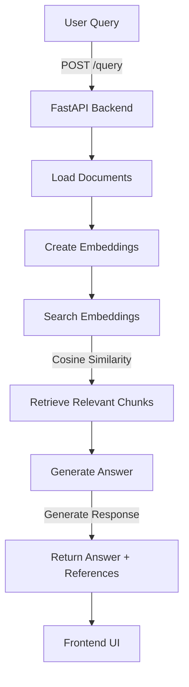

# How Fiona Chatbot Works

## Backend

The backend is built using **FastAPI** and is responsible for processing user queries, retrieving relevant information, and generating responses. Here's how it works:

### 1. Startup Process
- When the backend starts, the `startup_event` function in `app.py` is triggered.
- It calls `load_documents` to load the content of the documents (`features_of_steve.txt` and `plan_your_research_project.txt`) from the `backend/documents` directory.
- The loaded documents are passed to `create_embeddings` in `embedding_manager.py`, which generates vector embeddings using the `SentenceTransformer` model. These embeddings are stored in memory for later use.

### 2. Query Handling
- The `/query` endpoint in `app.py` receives user queries as POST requests.
- The query is passed to `search_embeddings` in `retrieval.py`, which calculates the similarity between the query and the precomputed embeddings using cosine similarity. It retrieves the most relevant document chunks.
- The retrieved chunks are passed to `generate_answer` in `llm_generator.py`, which uses a language model (`flan-t5-large`) to generate a response. The response includes the answer and references to the source documents.

### 3. Logging
- Logging is configured in `app.py` to track key events, such as document loading, embedding creation, query reception, and response generation.

### 4. Dependencies
- The backend uses libraries like `sentence-transformers` for embeddings, `transformers` for language model inference, and `scikit-learn` for similarity calculations.

---

## Frontend

The frontend is a **React** application that provides a user interface for interacting with the chatbot. Here's how it works:

### 1. User Interface
- The main component is `Chat.js`, which contains a text area for user input, a button to send queries, and a section to display responses and references.
- The UI is styled using `Chat.css` and `styles.css` for a clean and modern look.

### 2. Query Submission
- When the user enters a query and clicks the "Send" button, the `handleQuery` function in `Chat.js` sends the query to the backend's `/query` endpoint using a POST request.

### 3. Response Handling
- The backend's response is received as JSON, containing the generated answer and references to the source documents.
- The response is displayed in the UI, along with the references.

### 4. Logging
- Console logs in `Chat.js` track the queries sent to the backend and the responses received, making it easier to debug frontend-backend communication.

---

## Integration Between Backend and Frontend

### 1. API Communication
- The frontend communicates with the backend via HTTP requests to the `/query` endpoint. The backend runs on `http://localhost:8000`, and the frontend runs on `http://localhost:3000`.

### 2. CORS Configuration
- The backend uses FastAPI's `CORSMiddleware` to allow cross-origin requests from the frontend.

---

## Deployment

### 1. Dockerized Setup
- Both the backend and frontend have `Dockerfile` configurations for containerized deployment.
- The `docker-compose.yml` file orchestrates the services, exposing the backend on port `8000` and the frontend on port `3000`.

### 2. CI/CD Pipeline
- The CI/CD pipeline monitors changes in the codebase and documents. It rebuilds and redeploys the application when changes are detected.