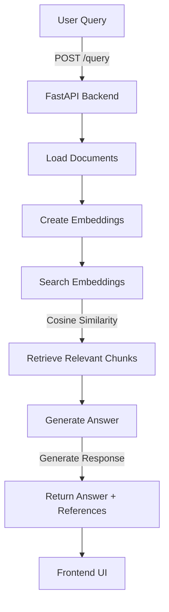

# Fiona Chatbot

## Overview

Fiona Chatbot is a full-stack FastAPI/React application for chat interactions using document embeddings and a language model.

## Project Structure

-   **backend/**: FastAPI app, document processing, embeddings, retrieval, LLM generation, models, documents, embeddings storage, requirements, Dockerfile.
-   **frontend/**: React app (public assets, src code: App.js, Chat.js, api.js, components, styles), package.json, Dockerfile.
-   **docker-compose.yml**: Orchestrates backend and frontend services.

## Getting Started

1.  **Clone (should be add as collaborator)**: `git clone https://github.com/SaidBenaissa/fiona-chatbot.git && cd fiona-chatbot`
2.  **Backend**:
  -   `cd backend`
  -   `pip install -r requirements.txt`
  -   `uvicorn app:app --host 0.0.0.0 --port 8000 --reload`
3.  **Frontend**:
  -   `cd ../frontend`
  -   `npm install`
  -   `npm start`
4.  **Access**:
-   Backend API: `http://localhost:8000`
-   Frontend App: `http://localhost:3000`
-  Php apache integration: `http://localhost:8080/index.php`
